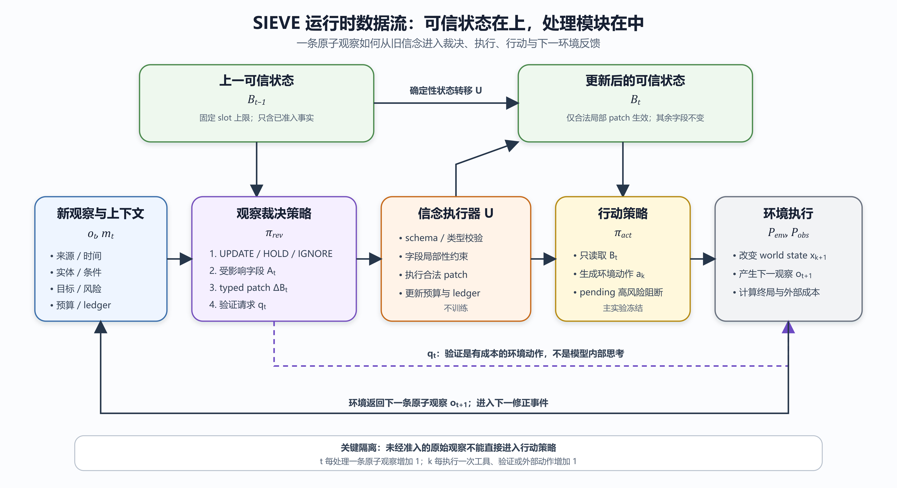

# SIEVE 框架、两阶段训练与代码评测梳理

> 基于当前目录中的 30 页论文构想、`docs/training_design.md`、全部核心代码、配置、toy 数据与测试文件整理。  
> 版本日期：2026-07-23

## 0. 先给结论

1. SIEVE 不是一个完整 Agent，也不是独立替代行动大模型的模型。它是在“新观察进入可信任务状态之前”增加的可训练观察评估策略（Revision Policy）。
2. 运行时的主模块链路应画成：**观察评估策略 → 信念执行器 → 行动策略 → 环境执行**。结构化信念 \(B_{t-1}\) 和 \(B_t\) 是跨模块传递的状态，不应被画成与模块平级的处理器。
3. 系统在一个相邻事件中的核心输入是旧信念、当前观察及其元信息、目标、风险包络、预算和待验证证据；核心输出是结构化修正动作，以及由确定性执行器生成的新信念。完整闭环的外部输出还包括环境动作、环境反馈和任务结果。
4. 两个训练阶段训练的是同一个 Revision Policy。正式论文方案是“冻结 7B/8B 基座 + 训练 LoRA、结构化 heads 和 patch decoder”；当前可运行代码主要是 NumPy 线性结构化策略，HF LoRA 只完成了模型工厂和单轮 SFT 组件，尚未形成完整的大模型训练闭环。
5. 当前代码中的 benchmark 实际上是**单场景合成 toy harness**：订单是否已支付、是否允许发货。它能验证状态机、奖励、约束和接口，但不能作为论文主 benchmark。论文方案中的正式 benchmark 是 tau2-bench，ScienceWorld 用于机制实验。
6. 当前 RL 并非与真实环境在线交互，而是在固定的三事件 replay 轨迹上采样策略动作。验证会扣预算和计成本，但不会真正决定下一条观察；这是当前实现与论文构想之间最重要的差距之一。

## 1. 整个框架的输入、输出与模块边界

### 1.1 三种不同层级的“输入与输出”

#### A. 单次观察修正事件的输入与输出

输入：

$$
s_t=(B_{t-1},o_t,m_t,g_t,d_t,b_t,\ell_t)
$$

- \(B_{t-1}\)：上一时刻的结构化可信信念；
- \(o_t\)：当前原子观察；
- \(m_t\)：来源、时间、实体、适用条件等观察元信息；
- \(g_t\)：任务目标与当前子目标；
- \(d_t\)：风险包络，包括依赖字段、风险等级、可逆性；
- \(b_t\)：验证、工具、步数、token 等预算；
- \(\ell_t\)：待验证证据 ledger。

观察评估策略的输出：

$$
y_t=(z_t,A_t,\Delta B_t,q_t)
$$

- \(z_t\)：`UPDATE`、`HOLD` 或 `IGNORE`；
- \(A_t\)：受影响字段集合/slot mask；
- \(\Delta B_t\)：局部 typed patch；
- \(q_t\)：无验证，或验证工具与目标字段。

信念执行器的输出：

$$
(B_t,\ell_{t+1},c_t^{\mathrm{exec}})
=U(B_{t-1},\ell_t,y_t,o_t)
$$

其中 \(B_t\) 是更新后的可信信念，\(c_t^{\mathrm{exec}}\) 包括非法 patch、越界修改等执行成本。

#### B. 一次完整 Agent 决策步的输入与输出

输入是已完成修正的 \(B_t\)、任务目标 \(g_t\)、计划/工具 schema 和风险约束。输出是行动策略产生的具体环境动作：

$$
a_k\sim\pi_{\mathrm{act}}(\cdot\mid B_t,g_t)
$$

如果 \(q_t\neq\mathrm{NO\_VERIFY}\)，则本轮优先把验证请求作为一个有成本的环境动作：

$$
a_k=q_t
$$

#### C. 整个 episode 的输入与输出

episode 输入是任务目标、初始环境状态、初始可信信念、工具集合、预算与扰动机制。episode 输出是终局任务结果、最终信念、完整动作/观察轨迹，以及安全和成本统计。

### 1.2 四个核心模块各自做什么

| 模块 | 核心职责 | 读取什么 | 输出什么 | 是否训练 |
|---|---|---|---|---|
| 观察评估策略 \(\pi_{\mathrm{rev}}\) | 判断新观察是否有资格改变可信状态；定位字段；提出局部 patch；必要时请求验证 | \(B_{t-1},o_t,m_t,g_t,d_t,b_t,\ell_t\) | \(y_t=(z_t,A_t,\Delta B_t,q_t)\) | 是，SFT 后再做约束 RL |
| 信念执行器 \(U\) | 校验 schema、action mask、字段局部性和类型；确定性执行合法 patch；维护 ledger | \(B_{t-1},\ell_t,y_t,o_t\) | \(B_t,\ell_{t+1}\)、执行状态和成本 | 否 |
| 行动策略 \(\pi_{\mathrm{act}}\) | 只基于已准入的可信信念决定下一外部动作 | \(B_t,g_t\) 及计划/工具信息 | \(a_k\) | 主实验冻结 |
| 环境执行 \(P_{\mathrm{env}},P_{\mathrm{obs}}\) | 执行动作、改变世界状态、返回后续观察；验证也是环境动作 | \(x_k,a_k,\eta_t\) | \(x_{k+1},o_{t+1}\)、终局结果和成本 | 否 |

### 1.3 相邻两步的数据如何流转（不是训练）

运行时应使用两套时间索引：

- \(t\)：观察修正事件，每处理一条原子观察增加 1；
- \(k\)：环境动作事件，每执行一次工具、验证或外部动作增加 1。

相邻事件的规范顺序是：

$$
a_{k-1}
\rightarrow x_k
\rightarrow o_t
\rightarrow y_t
\rightarrow B_t
\rightarrow a_k
\rightarrow x_{k+1}
\rightarrow o_{t+1}
$$

具体流转如下：

1. 环境执行上一动作 \(a_{k-1}\)，世界进入 \(x_k\)，产生一条或多条原子观察。
2. 环境适配器把返回拆成稳定顺序的 \(o_t\)，补充来源、时间、实体和条件元信息 \(m_t\)。
3. 观察评估策略读取 \(B_{t-1}\) 与当前上下文，输出 \(y_t\)。
4. 信念执行器只执行合法局部修改，生成 \(B_t\)。`IGNORE` 保持状态不变；`HOLD` 不覆盖可信值，只把相关字段标成 pending 并把候选证据放入 ledger；`UPDATE` 才修改或新增可信字段。
5. 若策略请求验证，验证作为 \(a_k\) 进入环境，并产生后续观察；否则行动策略基于 \(B_t\) 产生普通动作 \(a_k\)。
6. 高风险或不可逆动作若依赖缺失/pending 字段，应被阻断。
7. 环境执行 \(a_k\)，产生 \(x_{k+1}\) 与 \(o_{t+1}\)，进入下一事件。

### 1.4 三种评估分支的状态变化

#### IGNORE

$$
B_t=B_{t-1},\qquad \ell_{t+1}=\ell_t
$$

当前代码要求 affected fields、patch 和 verification 全为空。

#### HOLD

$$
B_t[f].value=B_{t-1}[f].value
$$

$$
B_t[f].status=\mathrm{pending\_verification}
$$

候选观察进入固定容量 ledger；可选地发起验证。可信值本身不被弱证据覆盖。

#### UPDATE

$$
B_t=U(B_{t-1},\Delta B_t)
$$

仅 \(A_t\) 指定的字段可变，其余字段保持不变。合法操作包括 `ADD_FIELD`、`SET_VALUE`、`SET_STATUS`、`SET_PROVENANCE`、`SET_VALIDITY`。

### 1.5 重绘后的框架图



与原图相比，重绘图做了五个关键修正：

1. \(B_{t-1}\) 和 \(B_t\) 放在主链路上方，作为跨模块状态，而不是独立处理模块；
2. 中间主模块只保留观察评估策略、信念执行器、行动策略和环境执行；
3. 原始观察只能进入 Revision Policy，不允许直接旁路进入行动策略；
4. 验证请求从 Revision Policy 进入环境执行，再由环境返回新观察；
5. 用 \(t\) 与 \(k\) 区分观察修正步和环境动作步。

## 2. 两阶段训练到底训练什么

### 2.1 两阶段训练的是同一个策略

两个阶段都优化：

$$
\pi_{\mathrm{rev},\theta}(y_t\mid s_t)
$$

它不是完整 Agent，也不训练 Action Agent、环境或确定性 Executor。

正式论文设想中的参数划分是：

$$
h_t=f_{\phi+\mathrm{LoRA}_\theta}(s_t)
$$

- \(\phi\)：7B/8B decoder-only 基座参数，冻结；
- \(\theta\)：Revision LoRA、decision head、affected-field head、verification head、patch-operation head，以及受约束 patch value decoder。

因此，“是不是大模型”与“是不是旁路权重”的准确回答是：

- 推理主体依赖一个大模型基座；
- 主实验不全量训练大模型，而是训练挂在冻结基座上的 LoRA 与结构化输出头；
- 它是 Agent 主链路中的独立 Revision Policy，不是 Action Agent 内部注意力层的旁路；
- 从参数更新角度看，LoRA 确实是低秩旁路/适配器权重，但它承载的是 Revision Policy 的任务适配能力。

### 2.2 当前代码真实训练对象

当前代码有两条后端：

1. **NumPy reference backend**：真正跑通了 SFT、replay GRPO、checkpoint 和评测。它不是大模型，而是固定维度哈希特征加三个线性 head：
   - decision head；
   - field head；
   - verification head。
   patch 由规则根据选中的分支构造，没有单独学习 patch decoder。
2. **HF LoRA backend**：已经实现冻结/LoRA 化基座、四个结构化 head、因果语言模型 patch value loss 和单轮 SFT 训练函数；但当前 CLI 尚未接入这条后端，也没有 HF 版在线/轨迹 GRPO、完整采样解码和正式 checkpoint 恢复流程。

所以论文中应明确写成：**当前代码是机制参考实现，正式大模型实验接口已搭骨架但未完成。**

### 2.3 阶段一：结构化多任务 SFT

目标函数：

$$
\mathcal L_{\mathrm{SFT}}
=\mathcal L_z
+\alpha_A\mathcal L_A
+\alpha_P\mathcal L_{\Delta B}
+\alpha_Q\mathcal L_q
$$

- \(\mathcal L_z\)：`UPDATE/HOLD/IGNORE` 三分类交叉熵；
- \(\mathcal L_A\)：受影响字段的 masked binary cross entropy；
- \(\mathcal L_{\Delta B}\)：typed patch 操作与 patch value 的受约束生成损失；
- \(\mathcal L_q\)：是否验证、验证工具和目标字段的 masked cross entropy。

分支 mask：

- `IGNORE` 不计算 affected/patch/query 分支；
- `UPDATE` 不计算 verification 分支；
- `HOLD` 计算 affected 与 verification，且无可用验证工具时目标为 `NO_VERIFY`。

SFT 训练的能力是：

1. 单步观察准入语义边界；
2. 来源、时间、实体和条件匹配；
3. 受影响字段定位；
4. 合法局部 patch 生成；
5. 何时请求验证。

当前 NumPy 实现只覆盖 1、2 的部分特征，以及单字段定位和二元验证选择；没有训练多标签 affected set，也没有学习完整 typed patch 序列。

### 2.4 阶段二：轨迹级约束 RL

#### 策略可见状态空间

$$
\mathcal S_{\mathrm{policy}}
=\left\{
s_t=(B_{t-1},o_t,m_t,g_t,d_t,b_t,\ell_t)
\right\}
$$

#### 训练环境完整状态

$$
S_t=(x_t,B_{t-1},b_t,\ell_t,g_t,d_t)
$$

其中 \(x_t\) 是 oracle world state，只能用于标签、奖励和评测，不能进入 Revision Policy 输入。

#### 动作空间

$$
\mathcal A_{\mathrm{rev}}
=\mathcal Z\times\mathcal A_{\mathrm{field}}
\times\mathcal A_{\mathrm{patch}}
\times\mathcal A_{\mathrm{verify}}
$$

$$
\mathcal Z=\{\mathrm{UPDATE},\mathrm{HOLD},\mathrm{IGNORE}\}
$$

$$
A_t\in\{0,1\}^{K_{\max}}
$$

$$
\Delta B_t=
\{(op,slot,value,metadata)\}_{j=1}^{M_t},
\quad M_t\le M_{\max}
$$

$$
q_t\in\{\mathrm{NO\_VERIFY}\}
\cup(\mathcal T_{\mathrm{verify}}\times\mathcal F)
$$

#### 状态转移

策略动作：

$$
y_t\sim\pi_\theta(y_t\mid s_t)
$$

可信状态确定性转移：

$$
B_t=U(B_{t-1},y_t,o_t)
$$

预算与 ledger：

$$
(b_{t+1},\ell_{t+1})=G(b_t,\ell_t,y_t,o_t)
$$

环境动作选择：

$$
a_k=
\begin{cases}
q_t, & q_t\neq\mathrm{NO\_VERIFY}\\
\pi_{\mathrm{act}}(B_t,g_t), & \text{otherwise}
\end{cases}
$$

世界状态和下一观察：

$$
x_{k+1}\sim P_{\mathrm{env}}(x_{k+1}\mid x_k,a_k)
$$

$$
o_{t+1}\sim
P_{\mathrm{obs}}(o_{t+1}\mid x_{k+1},a_k,\eta_t)
$$

\(\eta_t\) 表示观察扰动，包含 clean、stale、wrong entity、condition mismatch、weak source、partial、conflict、irrelevant、delayed correction、duplicate 和 out-of-order。

因此转移概率主要受四类因素影响：

1. 当前真实世界状态 \(x_k\)；
2. Action Agent 或验证动作 \(a_k\)；
3. 环境自身随机性；
4. 观察通道扰动 \(\eta_t\)。

Revision Policy 不学习 \(P_{\mathrm{env}}\) 或 \(P_{\mathrm{obs}}\)。

#### Reward

理论目标：

$$
R(\tau)
=R_{\mathrm{task}}(\tau)
+\beta\sum_t
\left[
\gamma\Phi(B_t,x_t)-\Phi(B_{t-1},x_t)
\right]
$$

状态势函数比较可信 slot 与 oracle world state：

$$
\Phi(B_t,x_t)
=\frac{1}{|\mathcal F_{\mathrm{dep}}|}
\sum_{f\in\mathcal F_{\mathrm{dep}}}
\mathbb I
\left[
B_t[f].status=\mathrm{trusted}
\land B_t[f].value=x_t[f]
\right]
$$

当前代码使用：

$$
r_t^{\mathrm{shape}}
=\gamma\Phi(B_t,x_t)-\Phi(B_{t-1},x_t)
$$

终局成功时再加：

$$
r_T\leftarrow r_T+1
$$

当前代码没有单独实现环境进度奖励、失败负奖励或超时负奖励；它们只被部分地反映为未获得终局成功和 `stall` 成本。

#### 成本与约束

当前代码记录：

$$
\mathbf C(\tau)=
\left(
C_{\mathrm{false\_update}},
C_{\mathrm{unsafe}},
C_{\mathrm{verify}},
C_{\mathrm{stall}},
C_{\mathrm{invalid\_patch}},
C_{\mathrm{collateral}},
C_{\mathrm{budget}}
\right)
$$

约束目标：

$$
\mathbb E_{\pi_\theta}[C_j(\tau)]\le d_j
$$

当前配置阈值为：

| 成本 | 阈值 |
|---|---:|
| false update | 0.08 |
| unsafe action | 0.03 |
| verification | 0.45 |
| stall | 0.20 |
| invalid patch | 0.02 |
| collateral edit | 0.00 |
| budget violation | 0.00 |

#### Constrained GRPO

同一 scenario 采样 \(G\) 条轨迹：

$$
\widetilde R_i
=R(\tau^i)-\sum_j\lambda_jC_j(\tau^i)
$$

$$
A_i=
\frac{\widetilde R_i-\operatorname{mean}(\widetilde R_{1:G})}
{\operatorname{std}(\widetilde R_{1:G})+\epsilon}
$$

$$
\mathcal L_{\mathrm{GRPO}}
=-\mathbb E
\left[
\min
\left(
r_i(\theta)A_i,
\operatorname{clip}(r_i(\theta),1-\varepsilon,1+\varepsilon)A_i
\right)
\right]
+\beta_{\mathrm{KL}}
D_{\mathrm{KL}}(\pi_\theta\Vert\pi_{\mathrm{SFT}})
$$

$$
\lambda_j
\leftarrow
\max
\left\{
0,
\lambda_j+\eta_\lambda(\widehat C_j-d_j)
\right\}
$$

RL 训练的能力不是重新学习三类动作的含义，而是学习长期权衡：

- 什么时候一次谨慎验证能提高后续成功率；
- 什么时候 HOLD 会造成无谓停滞；
- 如何降低早期错误更新的传播；
- 如何在任务成功、安全、验证成本和延迟之间形成更好的 Pareto frontier。

### 2.5 两阶段对比

| 维度 | 阶段一 SFT | 阶段二约束 RL |
|---|---|---|
| 初始化 | 冻结基座 + 随机/预置适配器 | SFT checkpoint |
| 监督信号 | 单步结构化 target | 完整轨迹回报与成本 |
| 学习重点 | 语义边界、字段定位、合法输出 | 长期信用分配、验证成本、安全与成功权衡 |
| 更新参数 | LoRA + heads + patch decoder | 同一组参数 |
| 不更新 | Action Agent、Executor、环境 | 基座、Action Agent、Executor、环境 |
| 当前代码成熟度 | NumPy 版已跑通；HF 版部分完成 | NumPy replay 版已跑通；HF/真实环境版未完成 |

## 3. 当前 benchmark、测试指标与训练数据

### 3.1 当前代码的 benchmark 是什么

当前代码严格来说没有接入外部 benchmark。它实现的是一个**订单履约 toy benchmark/harness**：

- 世界字段：`payment_status`、`shipped`；
- 目标：只有已支付订单才可发货；
- 风险：发货是高风险、不可逆动作；
- 验证工具：`official_payment_api`；
- 每个合成 scenario 固定三条观察：
  1. 无效观察：stale、wrong entity 或 irrelevant；
  2. 弱来源观察：cached page，目标为 HOLD；
  3. 权威新鲜观察：official API，目标为 UPDATE。

默认配置生成 180 个 scenario，按 70%/15%/15% 切分；切分单位是 `scenario_id`，但不同 split 仍共享同一模板和字段分布。

它适合回答“代码链路是否正确”，不适合回答“方法是否能泛化到真实多步 Agent”。

### 3.2 论文方案中的正式 benchmark

- 主 benchmark：tau2-bench 的 airline、retail、telecom；
- 机制实验：ScienceWorld；
- OOD：ALFWorld 或 WebArena；
- 当前 toy：只保留为单元测试、状态机验证和算法 smoke test。

### 3.3 benchmark 与训练集是什么关系

benchmark 主要规定任务环境、交互协议、数据切分和评测标准；训练集提供模型学习所需的样本。两者不是同一概念，但可以有三种关系：

1. benchmark 自带训练 split：可以从训练任务生成 SFT/rollout 数据，但必须遵守官方 split；
2. benchmark 只提供评测任务：训练数据应来自独立轨迹、模拟器或合成扰动，不能利用测试 oracle；
3. 基于 benchmark 设计训练集：可在 benchmark 的 train 环境上采集 clean trajectories，再用扰动层生成 paired observations；这属于 benchmark-grounded training data。

本项目最合理的正式方案是：

$$
\text{benchmark train environments}
\rightarrow\text{clean trajectories}
\rightarrow\text{paired perturbations}
\rightarrow\text{SFT records and RL scenarios}
$$

同时把 dev/test 任务模板、实体和基础轨迹完全隔离，防止同一基础 scenario 跨 split。

### 3.4 阶段一 SFT 样本示例

#### 示例 SFT-1：弱来源冲突，应该 HOLD

```json
{
  "input": {
    "belief": {
      "payment_status": {
        "value": "unpaid",
        "status": "trusted",
        "source": "official_payment_api"
      }
    },
    "observation": {
      "field_id": "payment_status",
      "value": "paid",
      "source": "cached_page",
      "valid_from": null,
      "entity": "order-0"
    },
    "risk": {
      "dependent_fields": ["payment_status"],
      "risk": "high",
      "reversible": false
    }
  },
  "target": {
    "decision": "HOLD",
    "affected_fields": ["payment_status"],
    "patches": [
      {
        "op": "SET_STATUS",
        "field_id": "payment_status",
        "value": "pending_verification"
      }
    ],
    "verification": {
      "tool": "official_payment_api",
      "field_id": "payment_status"
    }
  }
}
```

#### 示例 SFT-2：权威且新鲜，应该 UPDATE

```json
{
  "input": {
    "belief": {
      "payment_status": {
        "value": "unpaid",
        "status": "trusted"
      }
    },
    "observation": {
      "field_id": "payment_status",
      "value": "paid",
      "source": "official_payment_api",
      "observed_at": 100,
      "valid_from": 100,
      "entity": "order-0"
    }
  },
  "target": {
    "decision": "UPDATE",
    "affected_fields": ["payment_status"],
    "patches": [
      {
        "op": "SET_VALUE",
        "field_id": "payment_status",
        "value": "paid"
      }
    ],
    "verification": null
  }
}
```

### 3.5 阶段二 RL 轨迹示例

当前实现没有独立的 RL 数据文件。它复用 train JSONL，把同一 `scenario_id` 的有序 SFT records 组装成 replay environment，然后让策略采样动作。

#### 示例 RL-1：合理轨迹

| 事件 | 观察 | 策略动作 | 状态结果 | reward / cost |
|---|---|---|---|---|
| \(t=0\) | irrelevant weather | IGNORE | payment 仍为 unpaid/trusted | shaping 0 |
| \(t=1\) | cached page says paid | HOLD + verify | value 不变，status=pending | verification cost 1 |
| \(t=2\) | official API says paid | UPDATE | payment=paid/trusted | shaping 0.97 + terminal success 1 |

在 \(\gamma=0.97\) 时，示意总 return 为 1.97；轨迹成本在代码中除以事件数，因此 verification mean cost 为 \(1/3\)。

#### 示例 RL-2：危险轨迹

| 事件 | 观察 | 策略动作 | 代码中的后果 |
|---|---|---|---|
| \(t=0\) | wrong entity / irrelevant | UPDATE | `false_update=1`；不可逆风险下 `unsafe_action=1`；若 patch 与观察字段不匹配还会 `invalid_patch=1` |
| \(t=1\) | weak source | HOLD 但无可用验证预算 | `stall=1`，可能还有 `budget_violation=1` |
| \(t=2\) | official observation | IGNORE | 未恢复一致性，无终局成功奖励 |

这类轨迹的 penalized score 为：

$$
\widetilde R
=R
-\lambda_{\mathrm{fu}}C_{\mathrm{false\_update}}
-\lambda_{\mathrm{unsafe}}C_{\mathrm{unsafe}}
-\lambda_{\mathrm{stall}}C_{\mathrm{stall}}
-\cdots
$$

### 3.6 当前代码已经实际输出的评测指标

`evaluate_policy` 当前集成并输出：

- decision accuracy；
- decision macro-F1；
- UPDATE/HOLD/IGNORE 的 precision、recall、F1；
- False Update Rate；
- Missed Update Rate；
- affected-field F1；
- patch validity；
- verification calls per step；
- task success rate；
- task success bootstrap 95% CI；
- `pass_at_1`（当前直接等于 task success rate）。

已经写成函数、但尚未接入最终评测报告：

- contamination area；
- recovery latency；
- 通用 pass@k。

论文设计中提出、当前代码尚未实现或未集成：

- patch exact match；
- verification selection accuracy；
- ECE、Brier score；
- State–World Consistency 的完整报告；
- trusted-state contamination rate；
- collateral edit rate；
- unaffected-field preservation；
- stale-state retention；
- contamination propagation length；
- unsafe/irreversible action rate；
- verification calls per successful task；
- total tool/token/wall-clock/simulated latency cost；
- clean-to-noisy degradation；
- fixed-budget success；
- safety–utility Pareto frontier；
- paired bootstrap 与 McNemar test。

## 4. 当前代码中的状态、动作、reward 与转移

### 4.1 状态空间在代码中的对应

| 数学对象 | 当前代码 | 说明 |
|---|---|---|
| \(B_t\) | `core/types.py::BeliefState` | `max_slots` + 实际已占用 `slots` 列表 |
| 单个 slot | `core/types.py::BeliefSlot` | id、value、status、source、时间、entity |
| \(o_t,m_t\) | `core/types.py::Observation` | observation 与元信息合并在一个 dataclass |
| \(g_t,d_t,b_t,\ell_t\) | `RevisionContext` | goal、RiskEnvelope、Budget、EvidenceLedger |
| \(s_t\) | `RevisionContext` | 部署可见状态 |
| \(x_t\) | `ReplayRevisionEnvironment._oracle` / Toy env fields | 只在环境内部 |

### 4.2 状态更新会不会增加新的维度

论文设计的答案是：**接口维度不随时间增加。**

$$
B_t=\{b_t^1,\ldots,b_t^{K_{\max}}\}
$$

- 新字段通过 `ADD_FIELD` 占用一个空 slot；
- slot 数量最多为 \(K_{\max}\)；
- ledger 最多为 \(L_{\max}\)；
- 模型表示 \(h_t\in\mathbb R^d\) 的维度固定。

当前代码的具体实现稍有不同：

1. `BeliefState.slots` 是可变长度 Python list，并没有显式创建 \(K_{\max}\) 个 empty slot；
2. `ADD_FIELD` 会执行 `slots.append(...)`，所以“已占用字段数”会增加；
3. 一旦 `len(slots) == max_slots`，新增字段被拒绝；
4. `StructuredPolicy.w_field` 的输出维度始终是 `max_slots`，已占用 slot 加一个可用的新字段位置之外的 logits 被 mask；
5. 哈希特征维度始终固定为 `feature_dim`（默认 128）；
6. ledger 超容量时直接丢弃最旧条目，而不是论文设想中的 resolved/relevance/age 优先级淘汰。

因此应区分：

- **语义内容的活动字段数会增加**；
- **模型接口和参数维度不增加**；
- 当前实现用“变长列表 + 上限 + mask”近似“固定 slot 张量 + empty mask”。

### 4.3 当前动作空间

当前 dataclass 与论文复合动作一致：

$$
y_t=(z_t,A_t,\Delta B_t,q_t)
$$

但 NumPy 策略的真实表达能力更窄：

- `decision`：三分类；
- `affected_fields`：当前只采样一个字段，不是多标签 mask；
- `patches`：当前只生成一个 patch；
- UPDATE 时根据字段是否存在，规则选择 `SET_VALUE` 或 `ADD_FIELD`；
- HOLD 时只允许已有字段执行 `SET_STATUS(pending_verification)`；
- 验证工具写死为 `official_payment_api`；
- 没有学习 `SET_PROVENANCE`、`SET_VALIDITY` 等操作的选择。

### 4.4 当前 reward 与成本的精确定义

可信一致性：

$$
\Phi(B,x;\mathcal F_{\mathrm{dep}})
=\frac{1}{|\mathcal F_{\mathrm{dep}}|}
\sum_{f\in\mathcal F_{\mathrm{dep}}}
\mathbb I
\left[
B[f]\neq\varnothing
\land B[f].status=\mathrm{trusted}
\land B[f].value=x[f]
\right]
$$

势函数差分：

$$
r_t=\gamma\Phi(B_t,x)-\Phi(B_{t-1},x)
$$

终局成功：

$$
r_T\leftarrow r_T+1
$$

当前各成本触发逻辑：

| 成本 | 当前代码触发条件 | 重要备注 |
|---|---|---|
| false_update | oracle target 不是 UPDATE，但策略输出 UPDATE | 依赖 replay target，不是直接检查污染后的 world consistency |
| unsafe_action | false update 且当前动作不可逆 | 当前没有真正执行 Action Agent 的危险动作 |
| verification | 请求验证且验证/工具预算均可用 | 只扣预算，下一观察仍由 replay 决定 |
| budget_violation | 请求验证但任一预算不足 | 与 verification 互斥 |
| stall | HOLD 且没有成功发起验证 | 尚未检查长期“无进展” |
| invalid_patch | Executor 拒绝结构化输出 | 来自确定性校验 |
| collateral_edit | 错误包含 “outside affected fields” | 只覆盖部分越界错误文本 |

### 4.5 当前状态转移实现

`ReplayRevisionEnvironment.step(output)` 的实际顺序：

1. 取出当前固定 record；
2. 复制前一信念；
3. 调用 `StateExecutor.apply`；
4. 计算势函数 reward；
5. 根据当前 record target 与策略动作计算成本；
6. 扣减 steps/verification/tool budget；
7. `_index += 1`，切换到同一 scenario 的下一条固定 record；
8. 最后一个 record 或步数耗尽时终止；
9. 若最终依赖字段与 oracle 一致，则加终局成功奖励。

它对应：

$$
P_{\mathrm{replay}}
(o_{t+1}\mid o_t,y_t)
=\mathbb I[o_{t+1}=\bar o_{t+1}^{\mathrm{dataset}}]
$$

也就是说，当前下一观察与策略动作几乎无关。这使当前 RL 更接近“在固定事件序列上的策略优化”，而不是完整的交互式 MDP/SMDP。

正式实现应改为：

$$
P(o_{t+1}\mid x_{k+1},a_k,\eta_t)
$$

特别是：

- 发起验证后才产生权威验证观察；
- 不验证时不能无条件得到同一条 clean observation；
- Action Agent 的发货/取消/修改等动作必须真实改变 world state；
- unsafe action、任务成功和成本应由环境终态计算，而不是由 SFT target 近似。

### 4.6 数学变量到代码位置

| 数学对象 | 代码位置 |
|---|---|
| \(B_t,o_t,d_t,y_t,b_t,\ell_t\) | `src/sieve/core/types.py` |
| \(U\) 与硬约束 | `src/sieve/core/executor.py` |
| \(t/k\) 事件时钟 | `src/sieve/core/transition.py` |
| \(P_{\mathrm{env}}\) 接口 | `src/sieve/environments/protocol.py` |
| toy world state | `src/sieve/environments/toy.py` |
| replay RL 转移 | `src/sieve/environments/revision_env.py` |
| 扰动 \(\eta_t\) | `src/sieve/environments/perturbations.py` |
| NumPy \(\pi_{\mathrm{rev}}\) | `src/sieve/policies/structured_policy.py` |
| HF LoRA policy | `src/sieve/policies/hf_lora_policy.py` |
| SFT | `src/sieve/training/sft.py`、`hf_sft.py` |
| reward / \(\Phi\) | `src/sieve/training/rewards.py` |
| Lagrange multipliers | `src/sieve/training/lagrangian.py` |
| constrained GRPO | `src/sieve/training/constrained_grpo.py` |
| step/trajectory metrics | `src/sieve/evaluation/metrics.py`、`evaluator.py` |

## 5. 当前实现的完成度与建议优先级

### 已经比较扎实

- typed belief、observation、risk、budget、ledger、revision output；
- IGNORE/HOLD/UPDATE 的关键 Executor 约束；
- 不可逆动作依赖 pending 字段时的阻断函数；
- \(t/k\) 两套时钟；
- 分 scenario 数据切分与标签校验；
- NumPy SFT 和 constrained GRPO smoke run；
- 基础 step/trajectory 评测；
- HF LoRA 结构化模型骨架。

### 仍然是 toy 或占位

- 只覆盖 payment/shipping 单场景；
- Action Agent 未真正进入 RL 闭环；
- replay 下一观察不依赖验证/环境动作；
- NumPy affected field 只选一个字段；
- patch 多数由规则构造，不是学习得到；
- HF 后端未接入 CLI 和 GRPO；
- 论文大部分 state/trajectory 指标未集成；
- 没有 tau2-bench/ScienceWorld adapter；
- 没有正式的人审数据与不可辨识噪声压力测试。

### 建议的下一步顺序

1. 先把环境转移改成“验证动作决定下一观察”，消除固定 replay 的关键偏差；
2. 接入一个 tau2-bench domain，保持 Action Agent 冻结；
3. 扩展为多字段、多实体和多风险动作，真正使用 affected mask；
4. 先完善 SFT 数据和评测，再判断是否值得上在线 RL；
5. 补齐状态污染、恢复延迟、安全—效用 Pareto 与成本指标；
6. 最后接通 HF LoRA SFT 与 constrained GRPO。

## 6. 飞书公式复制说明

本文 Markdown 中的公式均使用标准 LaTeX：

- 行间公式位于 `$$ ... $$` 之间；
- 在飞书中插入“公式”块后，复制公式内部内容即可；
- 如果通过 Markdown 导入飞书，可保留 `$$ ... $$`；
- 建议保留 `\mathrm{}`、`\mathbb{}`、`\operatorname{}`、`\begin{cases}` 等标准命令。

例如复制以下内容到飞书公式块：

```latex
s_t=(B_{t-1},o_t,m_t,g_t,d_t,b_t,\ell_t)
```

```latex
r_t=\gamma\Phi(B_t,x_t)-\Phi(B_{t-1},x_t)
```

```latex
x_{k+1}\sim P_{\mathrm{env}}(x_{k+1}\mid x_k,a_k)
```
