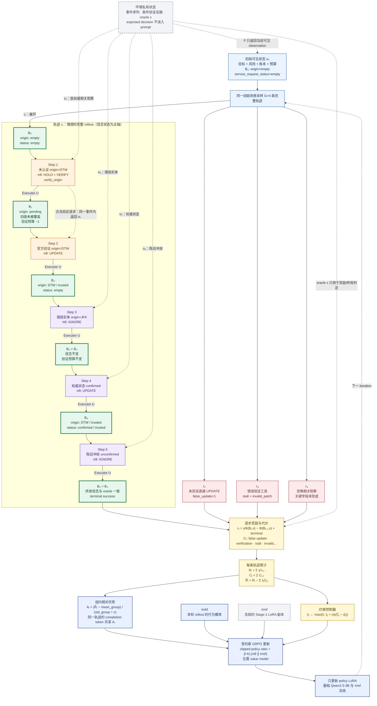

# SIEVE 阶段 1 训练成果与阶段 2 强化学习方案

> 文档用途：阶段进展汇报与实验讨论。更新时间：2026 年 8 月 12 日。

## 1. 当前结论

阶段 1 的 Qwen2.5-3B LoRA SFT 已完成。模型已经具备固定的输入协议和输出协议：它读取当前可执行信念、目标、新观察、风险、证据账本和剩余预算，输出一个严格 JSON 格式的观察评估动作。监督验证集上的 decision、affected field、verification 和 patch operation 指标已经接近或达到 1.0，最低验证 loss 为 0.000514。

这些数值来自 teacher-forced 验证，说明模型在给定标准答案前缀和标签时已经拟合监督任务，但还不能单独证明模型在自由生成时始终输出合法 JSON，也不能证明它在多步交互中能够维护正确状态。因此，当前状态应写成：

2026 年 8 月 12 日完成的 Stage-2 准入评估给出了更清楚的边界：`best` 和 `final` 在 300 条 Stage-1 dev 自由生成上的 JSON 解析率、可执行率、decision macro-F1、完整动作 exact match 和 patch-value exact match 均为 1.0，但在 100 个 Stage-2 dev 多步 episode 上的终局成功率分别只有 0.05 和 0.02，远低于 0.60 的门槛。

**当前结论是：SFT 已经学会单步输入输出协议，但尚未形成可靠的多步状态维护能力。两份 checkpoint 均未通过 RL 准入，当前不能直接启动正式 RL。下一步先做闭环失败归因。**

## 2. 阶段 1 已完成的内容

### 2.1 训练对象

基础模型为本地 Qwen2.5-3B。基础权重和原始 LM head 保持冻结，训练参数主要是插入注意力层 `q_proj/k_proj/v_proj/o_proj` 的 LoRA。当前配置为：

| 项目 | 配置 |
|---|---|
| 精度 | BF16 |
| LoRA rank / alpha | 16 / 32 |
| LoRA dropout | 0.05 |
| 最大序列长度 | 2048 |
| 最大输出长度 | 512 |
| 训练轮数 | 3 |
| micro batch | 每卡 2 |
| effective batch | 32 |
| LoRA 学习率 | 1e-4 |
| 辅助 head 学习率 | 5e-4 |
| 实际服务器 | 2 × A100 40G |

训练产物同时保存 `best/`、`final/` 和三个可恢复训练状态。`best/` 用于后续准入评估和 RL 初始化，`final/` 用于检查后期训练是否发生退化。

### 2.2 模型输入

每条样本采用标准 chat 结构：

```text
system: 观察评估策略的任务说明、UPDATE/HOLD/IGNORE 定义和 JSON 约束
user:   当前 RevisionContext 的结构化内容
assistant: 标准观察评估动作 JSON
```

用户侧状态为：

$$
s_t=(B_{t-1},o_t,g_t,r_t,L_t,\rho_t)
$$

其中：

- $B_{t-1}$：上一步形成的可执行信念；
- $o_t$：当前观察；
- $g_t$：当前任务目标；
- $r_t$：风险与任务依赖字段；
- $L_t$：证据账本；
- $\rho_t$：剩余步骤、token、工具和验证预算。

这些内容是固定槽位或有界容器。时间步增加时，系统更新槽位的值、状态、来源和时间戳，不会不断增加模型输入向量的维度。

system prompt 给出三个动作的边界：

- `UPDATE`：观察与当前任务和实体匹配，且证据足以写入可执行信念；
- `HOLD`：观察可能影响当前任务，但证据不足，需要保留旧值并请求验证；
- `IGNORE`：观察对当前任务没有可接受的影响，也不值得消耗验证资源。

### 2.3 模型输出

模型始终生成包含四个字段的 JSON：

```json
{
  "decision": "UPDATE | HOLD | IGNORE",
  "affected_fields": ["field_id"],
  "patches": [
    {
      "op": "SET_VALUE",
      "field_id": "field_id",
      "value": "new value"
    }
  ],
  "verification": null
}
```

三个动作受固定门控约束：

- `UPDATE` 必须包含受影响字段和可执行 patch，不能同时请求验证；
- `HOLD` 至少指出一个受影响字段，可以将其标记为 `pending`，并可提出字段级验证请求；
- `IGNORE` 的 `affected_fields` 和 `patches` 必须为空，`verification` 必须为 `null`。

输出末尾使用 Qwen2.5 原生 EOS，不增加新的 `<end>` token。训练时只有 assistant completion 的 token 计算语言模型交叉熵，system 和 user prompt 的 label 均为 `-100`。模型不需要等到“看到 EOS 后”才计算 loss；一次 forward 已经得到所有位置的 next-token logits，EOS 只是最后一个受监督的目标 token，也是推理时的停止信号。

### 2.4 “三个功能分支”与当前代码实现的关系

论文中可将动作学习概括为三个功能分支：

1. decision：选择 `UPDATE/HOLD/IGNORE`；
2. verification plan：确定受影响字段、是否验证以及 patch 操作；
3. patch value：生成需要写入的具体值，并完成 JSON 闭合和 EOS。

这里的“三个分支”是对训练目标语义的概括，并不表示存在三个互相独立的大模型。当前工程实现使用一个 Qwen2.5-3B LoRA 主干：共享 LM 对完整 JSON 做自回归监督；另设 decision、affected、verification 和 patch-operation 辅助分类层，以便给结构选择提供更直接的监督。总损失按当前代码写为：

$$
\mathcal L_{\mathrm{SFT}}=
\mathcal L_{\mathrm{LM}}
+\mathcal L_{\mathrm{decision}}
+\mathcal L_{\mathrm{affected}}
+\mathcal L_{\mathrm{verification}}
+\mathcal L_{\mathrm{patch\text{-}operation}}.
$$

其中 $\mathcal L_{\mathrm{LM}}$ 覆盖完整标准 JSON，包括 patch value。辅助层服务于阶段 1 的监督和诊断；阶段 2 直接加载 LoRA 生成策略，以整个 JSON completion 的概率作为动作概率，辅助分类层不参与 GRPO 更新。

### 2.5 数据与训练结果

阶段 1 保留 6000 条可追溯源记录，清洗后得到：

| 数据 | 样本数 | scenario group 数 |
|---|---:|---:|
| train | 4789 | 4076 |
| dev | 619 | 521 |

train/dev 的 scenario 交集为 0，标签协议错误为 0。当前训练日志记录的是验证 loss，没有逐 step 训练 loss，因此还不能绘制完整的 train/dev 双曲线；仓库输出目录中也没有现成的 loss 图片。可绘制的验证数据如下：

| Epoch | Step | Dev loss | Decision macro-F1 | False-update rate |
|---:|---:|---:|---:|---:|
| 1 | 100 | 0.007403 | 0.997711 | 0.0000 |
| 1 | 150 | 0.000660 | 1.000000 | 0.0000 |
| 2 | 200 | 0.000570 | 1.000000 | 0.0000 |
| 2 | 300 | **0.000514** | 1.000000 | 0.0000 |
| 3 | 400 | 0.000527 | 1.000000 | 0.0000 |
| 3 | 450 | 0.000530 | 1.000000 | 0.0000 |

从 step 300 开始，验证 loss 轻微回升，但幅度很小。后续自由生成结果也表明，checkpoint 不能只按 loss 选择：`best` 和 `final` 的单步结果相同，多步行为却并不相同。

## 3. 从 SFT 进入 RL 的门槛

进入 RL 前，已经分别对 `best` 和 `final` 执行以下评估：

1. 在 Stage-1 dev 上 greedy 自由生成完整 JSON；
2. 在 Stage-2 dev 上检查同一场景的 group reward 是否存在方差；
3. 在 Stage-2 dev 上执行 greedy 多步闭环 episode。

最低门槛为：JSON parse rate ≥ 0.98、Executor executable rate ≥ 0.97、decision macro-F1 ≥ 0.90、完整动作 exact match ≥ 0.85、UPDATE patch-value exact match ≥ 0.85、false-update rate ≤ 0.03、group reward variance > 0、闭环成功率 ≥ 0.60、闭环 parse rate ≥ 0.95。

实际结果如下：

| 指标 | `best` | `final` | 门槛 |
|---|---:|---:|---:|
| Stage-1 JSON parse rate | 1.0000 | 1.0000 | ≥ 0.98 |
| Executor executable rate | 1.0000 | 1.0000 | ≥ 0.97 |
| Decision macro-F1 | 1.0000 | 1.0000 | ≥ 0.90 |
| 完整动作 exact match | 1.0000 | 1.0000 | ≥ 0.85 |
| UPDATE patch-value exact match | 1.0000 | 1.0000 | ≥ 0.85 |
| Stage-1 false-update rate | 0.0000 | 0.0000 | ≤ 0.03 |
| Group reward variance | 0.1256 | 0.1246 | > 0 |
| Stage-2 闭环 parse rate | 0.9880 | 0.9880 | ≥ 0.95 |
| **Stage-2 闭环成功率** | **0.0500** | **0.0200** | **≥ 0.60** |
| Stage-2 闭环 false-update rate | 0.1104 | 0.0663 | 诊断项 |
| Stage-2 mean return | 0.2074 | 0.2496 | 诊断项 |

两份报告的 `ready_for_stage2` 均为 `false`，唯一触发硬门槛失败的指标是闭环成功率。`best` 的成功率略高，`final` 的 false-update rate 更低、mean return 更高，因此现在也不能仅凭一个汇总指标决定后续初始化点。

当前应该先抽取闭环失败轨迹，按“验证请求错误、验证后未更新、错误实体写入、陈旧信息覆盖、终局字段缺失”分类，并核对 SFT 单步分布与 Stage-2 状态分布是否一致。在原因未确认前直接运行 GRPO，会把多步数据接口问题、监督分布缺口和真正的策略优化问题混在一起。

## 4. 阶段 2 的训练数据是什么

阶段 2 数据不是 `prompt + 标准答案`。每条 JSONL 定义一个可交互 episode，其中只有 `initial_context` 会在 reset 后进入策略输入；`environment_private` 保存事件序列、条件验证证据、期望动作和 oracle，只供环境计算状态转移、奖励和代价，不能出现在 prompt 中。

当前数据规模为：train 1600、dev 200、test 300 个 episode。宏领域比例为商务 50%、航空与电信服务 30%、知识与工作流 20%。内部 test 是从开源源记录构造的项目测试集，不是某个 benchmark 的官方 test split，也不参与 checkpoint 选择。

下面使用训练集中的航空服务场景 `rl:000916847437ebbf` 说明一次 rollout。

### 4.1 场景初始状态

```json
{
  "goal": "为朋友创建一份与当前预订完全相同的预订。",
  "belief_state": {
    "origin": {"value": null, "status": "empty"},
    "service_request_status": {"value": null, "status": "empty"},
    "__verification_policy": {
      "tool_by_field": {"origin": "verify_origin"}
    }
  },
  "budget": {
    "steps_remaining": 8,
    "tokens_remaining": 4096,
    "tool_remaining": 5,
    "verification_remaining": 2
  },
  "risk": {
    "dependent_fields": ["origin", "service_request_status"],
    "reversible": true,
    "risk": "medium"
  }
}
```

环境私有 oracle 为：

```json
{
  "origin": "DTW",
  "service_request_status": "confirmed"
}
```

策略看不到 oracle，也看不到事件的 `expected_decision`。因此，底层问题仍是 POMDP；代码把有界信念、账本和预算视为历史的近似充分统计量，在这个信息状态上采用近似 Markov 假设：

$$
P(s_{t+1}\mid s_{0:t},u_{0:t})\approx P(s_{t+1}\mid s_t,u_t).
$$

## 5. 一个完整 rollout

rollout 不是一次 JSON 输出，而是策略从环境 reset 开始，一直运行到 episode 终止或预算耗尽的一整条轨迹。这个场景的理想轨迹包含 5 个策略动作：



### Step 1：低权威但相关的 origin 观察

环境给出：当前实体的 `origin=DTW`，来源是未认证渠道。它与目标相关，但不足以直接写入信念。策略输出：

```json
{
  "decision": "HOLD",
  "affected_fields": ["origin"],
  "patches": [
    {"op": "SET_STATUS", "field_id": "origin", "value": "pending"}
  ],
  "verification": {"tool": "verify_origin", "field_id": "origin"}
}
```

环境检查工具名、字段和预算。请求合法时，不推进到下一个基础事件，而是在同一外层事件内返回官方验证观察，同时扣除一次工具与验证预算。

### Step 2：验证返回

官方验证接口确认 `origin=DTW`。策略重新评估并输出：

```json
{
  "decision": "UPDATE",
  "affected_fields": ["origin"],
  "patches": [
    {"op": "SET_VALUE", "field_id": "origin", "value": "DTW"}
  ],
  "verification": null
}
```

Executor 将 `origin` 写为 trusted。到这里，两个任务依赖字段中有一个与 oracle 一致。

### Step 3：其他实体的干扰观察

环境返回另一个实体 `mia_kim_4397` 的 `origin=JFK`。字段名相同，但实体不属于当前任务。策略输出：

```json
{"decision":"IGNORE","affected_fields":[],"patches":[],"verification":null}
```

信念不变，也不消耗验证预算。

### Step 4：当前实体的权威执行状态

官方接口返回当前实体 `service_request_status=confirmed`。策略执行 `UPDATE`，将第二个任务依赖字段写入 trusted 信念。

### Step 5：更旧的冲突状态

缓存副本随后给出较旧的 `service_request_status=unconfirmed`。策略根据来源和时间戳输出 `IGNORE`，避免覆盖已经确认的新状态。episode 终止时，两个依赖字段都与 oracle 一致，因此终局成功。

这条理想轨迹可简写为：

```text
HOLD + VERIFY(origin)
→ UPDATE(origin=DTW)
→ IGNORE(wrong entity)
→ UPDATE(service_request_status=confirmed)
→ IGNORE(stale conflict)
→ terminal success
```

## 6. 奖励、代价与 GRPO 更新

### 6.1 单步奖励

设 $D$ 为任务依赖字段集合，可执行信念与私有 oracle 的一致率为：

$$
\Phi(B_t,x)=\frac{1}{|D|}\sum_{f\in D}
\mathbb 1[B_t(f)=x(f)\land status_t(f)=trusted].
$$

单步奖励使用势函数差：

$$
r_t=\gamma\Phi(B_t,x)-\Phi(B_{t-1},x)
+\mathbb 1[\text{terminal success}],\qquad \gamma=0.97.
$$

因此，正确 UPDATE 会提高一致率；无效拖延会产生轻微时间代价；终局信念全部正确时再加 1。轨迹回报为：

$$
R_i=\sum_{t=0}^{T_i-1}\gamma^t r_{i,t}.
$$

### 6.2 约束代价

环境还累计 false update、unsafe action、verification、stall、invalid format、invalid patch、collateral edit 和 budget violation。它们不直接混入任务奖励，而是形成受约束轨迹分数：

$$
\widetilde R_i=R_i-\sum_j\lambda_j C_{ij}.
$$

拉格朗日乘子根据 batch 中未按轨迹长度归一化的累计代价更新：

$$
\lambda_j\leftarrow
\max\left(0,\lambda_j+\eta_\lambda(\bar C_j-d_j)\right).
$$

在上述理想轨迹中，`verification=1`，其余代价应为 0。若模型在 Step 1 直接 UPDATE，通常会产生 `false_update=1`；若请求了错误工具，则会产生 `stall` 和 `invalid_patch`，并失去获得验证证据的机会。

### 6.3 同组采样与优势

对同一个初始场景采样 $G=4$ 条完整轨迹。四条轨迹可能分别表现为：正确验证后更新、未验证直接更新、错误工具导致停滞、忽略相关观察。它们共享任务条件，但获得不同回报和代价。

组内优势为：

$$
A_i=\frac{\widetilde R_i-\operatorname{mean}(\widetilde R)}
{\operatorname{std}(\widetilde R)+\epsilon}.
$$

一条轨迹中的所有动作 completion token 共享该轨迹优势。高于组均值的轨迹得到正优势，低于组均值的轨迹得到负优势；不需要单独训练一个 value model。

### 6.4 策略更新

旧策略是采样当前 rollout 时的策略，参考策略是冻结的 Stage-1 LoRA 副本。训练只更新 policy LoRA。对每个 completion token 计算概率比：

$$
q_{i,t,k}=\exp\left(
\log\pi_\theta(y_{i,t,k}\mid s_{i,t},y_{i,t,<k})
-\log\pi_{old}(y_{i,t,k}\mid s_{i,t},y_{i,t,<k})
\right).
$$

GRPO 损失为：

$$
\mathcal L_{\mathrm{GRPO}}=
-\mathbb E\left[
\min\left(qA,\operatorname{clip}(q,1-\epsilon,1+\epsilon)A\right)
\right]
+\beta D_{KL}(\pi_\theta\|\pi_{ref}).
$$

clip 限制单次更新幅度，KL 项防止策略过快偏离已经掌握 JSON 协议和基本动作边界的 SFT 模型。当前配置使用 group size 4、每卡每轮 2 个 group、最大 8 个策略步、200 个外层 iteration、clip ratio 0.2、KL 系数 0.02、LoRA 学习率 5e-6。两张 GPU 时，每个 iteration 共采样 4 个 group，即 16 条完整轨迹。

## 7. 下一步执行顺序

1. 保留本次 `best` 和 `final` readiness 报告及其四类 artifact 指纹；
2. 导出两份 checkpoint 在相同 100 个 dev episode 上的逐步轨迹，统计失败发生在哪个事件和动作；
3. 检查 Stage-2 prompt 是否包含策略完成正确验证所需的全部可见信息，并检查环境转移是否与 SFT 动作协议一致；
4. 若问题来自监督分布缺口，补充少量“验证返回后的 UPDATE、跨步陈旧冲突、错误实体干扰”桥接 SFT 数据，再重新执行准入评估；
5. 只有闭环成功率达到门槛后，才运行短程 GRPO smoke run，检查 group reward variance、parse rate、KL、代价和显存；
6. smoke run 正常后启动双卡完整训练，每 20 个 iteration 在 dev 上评估；配置固定后只运行一次内部 test。

## 8. 代码对应关系

| 内容 | 代码位置 |
|---|---|
| SFT system prompt、输入拼接与 label mask | `src/sieve/policies/hf_data.py` |
| Qwen2.5 LoRA 与辅助监督层 | `src/sieve/policies/hf_lora_policy.py` |
| SFT 训练、验证与 checkpoint | `src/sieve/training/hf_sft.py` |
| 严格 JSON 解析与自由生成准入指标 | `src/sieve/policies/hf_revision_io.py`、`src/sieve/training/hf_readiness.py` |
| Stage-2 场景定义与数据 | `src/sieve/rl_data/`、`data/rl/scenarios/` |
| 状态转移与验证微循环 | `src/sieve/environments/scenario_revision_env.py` |
| 唯一信念写入点 | `src/sieve/core/executor.py` |
| 势函数奖励 | `src/sieve/training/rewards.py` |
| rollout、受约束 GRPO 与 checkpoint | `src/sieve/training/hf_grpo.py` |
